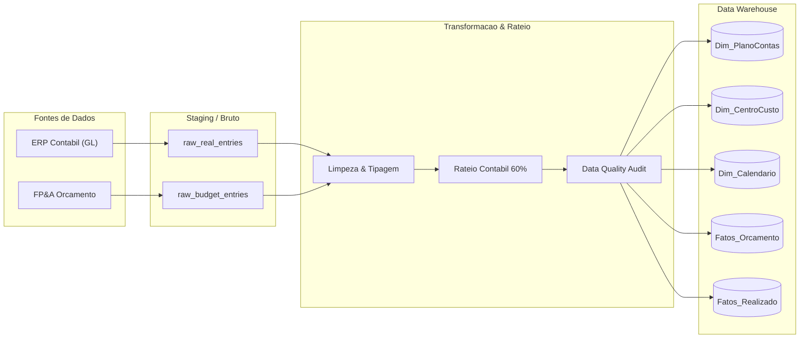

# Documentação Técnica e de Negócio: FP&A & Controladoria Industrial

Este documento detalha o dicionário de dados, as regras de negócio contábeis, as diretrizes de rateio e a linhagem de transformação de dados aplicada no projeto de FP&A e Controladoria Industrial para o setor de Beneficiamento de Tabaco.

---

## 1. Dicionário de Dados

### 1.1. Dimensão Plano de Contas (`Dim_PlanoContas`)

Tabela dimensional responsável pela estrutura hierárquica e ordenação do Demonstrativo de Resultados do Exercício (DRE Gerencial).

| Campo | Tipo de Dado | Restrição | Descrição |
| :--- | :--- | :--- | :--- |
| `ID_Conta` | VARCHAR(20) | PK | Código estruturado da conta contábil (Ex: `1.01.001`). |
| `Nome_Conta` | VARCHAR(150) | NOT NULL | Descrição formal da conta. |
| `Nivel1` | VARCHAR(100) | NOT NULL | Agrupamento macro da DRE (Receita Bruta, CPV, OPEX, etc.). |
| `Nivel2` | VARCHAR(100) | NOT NULL | Subgrupo de detalhamento operacional ou financeiro. |
| `Natureza` | VARCHAR(20) | NOT NULL | Natureza contábil da conta (`Debito` ou `Credito`). |
| `Ordem_DRE` | INTEGER | NOT NULL | Sequência numérica ordinal para ordenação da DRE. |

---

### 1.2. Dimensão Centros de Custo (`Dim_CentroCusto`)

Mapeia as unidades fabris, áreas de apoio e departamentos corporativos da indústria.

| Campo | Tipo de Dado | Restrição | Descrição |
| :--- | :--- | :--- | :--- |
| `ID_CentroCusto` | VARCHAR(20) | PK | Código identificador do centro de custo (Ex: `CC1001`). |
| `Nome_CentroCusto` | VARCHAR(150) | NOT NULL | Descrição da unidade ou linha operacional. |
| `Tipo_Unidade` | VARCHAR(50) | NOT NULL | Classificação do local (`Fabrica`, `Operacional`, `Matriz Corporativa`, `Comercial`). |
| `Area_Negocio` | VARCHAR(100) | NOT NULL | Macroárea de atuação funcional. |

---

### 1.3. Dimensão Calendário Fiscal (`Dim_Calendario`)

Base temporal que assegura a integridade do calendário fiscal e das safras anuais.

| Campo | Tipo de Dado | Restrição | Descrição |
| :--- | :--- | :--- | :--- |
| `Data` | DATE | PK | Data no formato ISO (`YYYY-MM-DD`). |
| `Ano` | INTEGER | NOT NULL | Ano civil da data. |
| `Mes` | INTEGER | NOT NULL | Número do mês (1 a 12). |
| `AnoMes` | INTEGER | NOT NULL | Chave numérica no formato `YYYYMM` (Ex: `202505`). |
| `NomeMes` | VARCHAR(20) | NOT NULL | Abreviação textual do mês (Ex: `Mai`, `Jun`). |
| `Trimestre` | INTEGER | NOT NULL | Número do trimestre (1 a 4). |
| `Semestre` | INTEGER | NOT NULL | Semestre civil (1 ou 2). |
| `Safra_Ano` | VARCHAR(50) | NOT NULL | Identificação da safra agrícola correspondente. |

---

### 1.4. Fato Orçamento Planejado (`Fatos_Orcamento_Planejado`)

Armazena a meta financeira e orçamentária aprovada pela diretoria para cada conta e centro de custo.

| Campo | Tipo de Dado | Restrição | Descrição |
| :--- | :--- | :--- | :--- |
| `ID_Orcamento` | INTEGER | PK (Auto) | Identificador sequencial do registro de orçamento. |
| `AnoMes` | INTEGER | NOT NULL | Mês de competência orçamentária (`YYYYMM`). |
| `Ano` | INTEGER | NOT NULL | Ano do exercício orçamentário. |
| `Mes` | INTEGER | NOT NULL | Mês do exercício orçamentário. |
| `ID_Conta` | VARCHAR(20) | FK | Chave estrangeira referenciando `Dim_PlanoContas`. |
| `ID_CentroCusto` | VARCHAR(20) | FK | Chave estrangeira referenciando `Dim_CentroCusto`. |
| `Valor_Orcado` | DECIMAL(18, 2) | NOT NULL | Montante orçado planejado em Reais (R$). |

---

### 1.5. Fato Lançamentos Contábeis Reais (`Fatos_Lancamentos_Realizados`)

Registros transacionais diários do Livro Razão contábil (*General Ledger*).

| Campo | Tipo de Dado | Restrição | Descrição |
| :--- | :--- | :--- | :--- |
| `ID_Lancamento` | VARCHAR(50) | PK | Código do documento contábil (Ex: `DOC-100245`). |
| `Data` | DATE | FK | Data da realização do lançamento. |
| `AnoMes` | INTEGER | NOT NULL | Competência de apuração contábil. |
| `ID_Conta` | VARCHAR(20) | FK | Chave estrangeira referenciando `Dim_PlanoContas`. |
| `ID_CentroCusto` | VARCHAR(20) | FK | Chave estrangeira referenciando `Dim_CentroCusto`. |
| `Valor_Realizado` | DECIMAL(18, 2) | NOT NULL | Montante efetivamente realizado em Reais (R$). |
| `Historico_Contabil`| VARCHAR(255) | NOT NULL | Descritivo explicativo do lançamento e sua origem. |

---

## 2. Regras de Negócio e Metodologia Contábil

### 2.1. Estrutura da DRE Gerencial
O cálculo da Demonstração do Resultado do Exercício segue as seguintes etapas:

1. **Receita Operacional Bruta**: Faturamento de exportação, mercado interno e subprodutos (talas/fumos picados).
2. **Deduções da Receita**: Impostos sobre vendas (PIS, COFINS, ICMS) e abatimentos.
3. **Receita Operacional Líquida**: `Receita Bruta - Deduções`.
4. **Custo dos Produtos Vendidos (CPV)**: Compra de matéria-prima (folha crua de tabaco), mão de obra direta de debulha/secagem, energia elétrica/caldeiras, embalagens C-48, manutenção fabril e depreciação.
5. **Margem Bruta (Lucro Bruto)**: `Receita Líquida - CPV Industrial`.
6. **Despesas Operacionais (OPEX)**: Fretes internacionais e terminal portuário, folha administrativa, TI, laudos fitossanitários/agronomia e facilities.
7. **EBITDA Gerencial**: `Margem Bruta - OPEX + Depreciação`.
8. **Resultado Financeiro**: Variação cambial líquida de contratos de exportação + receitas financeiras - juros sobre capital de giro.
9. **Resultado Antes dos Tributos (LAIR)**: `EBITDA - Depreciação + Resultado Financeiro`.
10. **Lucro Líquido do Exercício**: `LAIR - Provisão de IRPJ/CSLL`.

---

### 2.2. Regra de Rateio de Despesas Corporativas Indiretas
As despesas corporativas de TI (`CC3002`) e Recursos Humanos (`CC3003`) nas contas de serviços e licenças sofrem rateio gerencial:
- **60% do custo corporativo** é distribuído em partes iguais (15% cada) entre os quatro centros de custo produtivos:
  - `CC1001` - Recepção e Classificação de Folhas
  - `CC1002` - Linha de Debulha e Separação (Threshing)
  - `CC1003` - Secadores Contínuos e Redryer
  - `CC1004` - Prensagem, Embalagem e Armazéns C-48
- **40% do custo corporativo** permanece alocado na Matriz Corporativa.

---

## 3. Matriz de Rastreabilidade e Linhagem de Dados

---

Desenvolvido por **Iago Walter**  
Engenheiro de Produção | Especialista em BI, Modelagem Dimensional e Analytics Engineering
