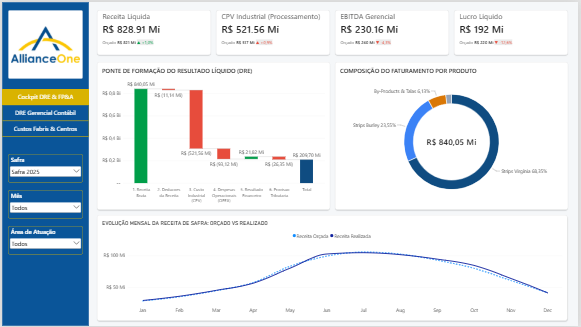
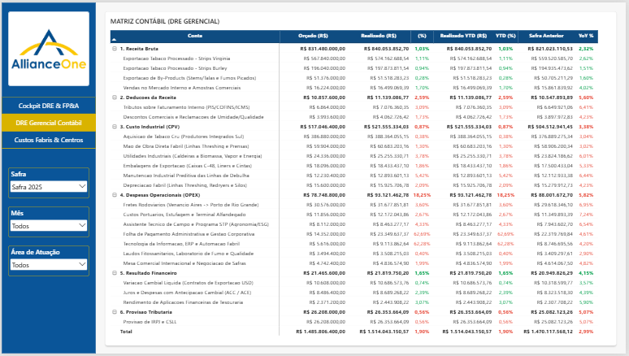
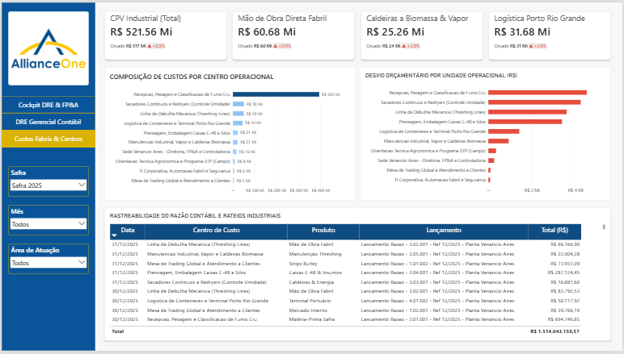
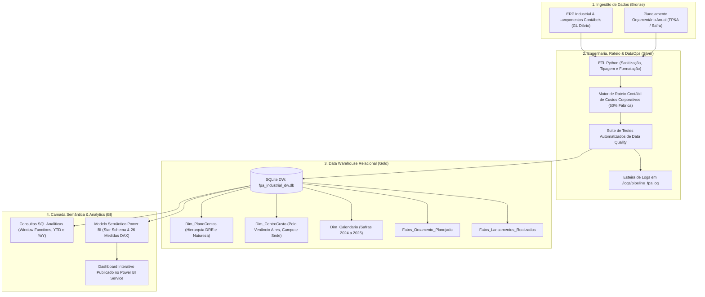
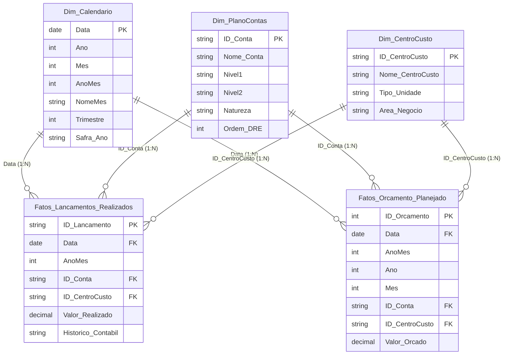

# Controladoria Industrial & FP&A: Gestão Orçamentária e DRE Gerencial

> **Nota do Projeto:** Estudo de caso prático de Controladoria Industrial e Planejamento e Controle Financeiro (FP&A) modelado sobre as particularidades operacionais de processamento e exportação de tabaco em folha (*Leaf Merchant*) no Polo Industrial de Venâncio Aires - RS (Alliance One Brasil). Os dados são 100% sintéticos, parametrizados e calibrados para refletir a sazonalidade de safra sul-brasileira, a estrutura de centros de custo fabris e a dinâmica cambial e tributária de exportação, em conformidade com as diretrizes de governança e LGPD.

Este projeto entrega uma solução *end-to-end* de Business Intelligence e Engenharia de Dados: desde a geração parametrizada de lançamentos diários e orçamentários, esteira ETL com motor de rateio de custos corporativos indiretos em Python, modelagem dimensional em Star Schema (*Ralph Kimball*) no SQLite Data Warehouse, até a camada analítica semântica com 26 medidas DAX e painel executivo de 3 visões no Power BI Service.

---

## Acesso ao Dashboard

🔗 **[Acessar o Relatório Interativo no Power BI Service](https://app.powerbi.com/view?r=eyJrIjoiMmVhYjVhZGEtYzQ3Mi00MTE5LWE4YmYtNzMwZjIyYzI1MDNlIiwidCI6ImRmN2Q2NTBkLWMyNmMtNDVhOC1hYjZhLTQwNTNhOGRhNDk5MCJ9)**

---

## Objetivo e Contexto de Negócio

No agronegócio exportador de tabaco, as companhias processadoras (*Leaf Merchants*) compram fumo cru em folha de milhares de produtores rurais integrados nos estados do Rio Grande do Sul, Santa Catarina e Paraná durante o primeiro quadrimestre do ano. O beneficiamento mecânico em linhas de debulha (*Threshing Lines*) e secadores contínuos (*Redryers*) ocorre em ritmo ininterrupto entre março e julho, enquanto os embarques de exportação concentram-se no Porto de Rio Grande (RS) de maio a novembro.

Gerenciar o fluxo financeiro e os desvios de custo (*Variances*) nesse ambiente exige um controle rigoroso de FP&A entre o Orçado e o Realizado. O painel responde diretamente às seguintes perguntas estratégicas da diretoria e dos gestores industriais:

* **Desempenho da DRE e EBITDA:** Como o Lucro Bruto, EBITDA e Lucro Líquido reais estão performando frente ao orçamento anual e em relação ao mesmo período do ano anterior (YoY)?
* **Variação YTD (Year-to-Date):** O desvio acumulado no ano fiscal é decorrente de atraso no cronograma de embarques ou aumento real de custos de produção?
* **Ofensores de Custos Fabris:** Quais etapas do processamento (Recepção, Debulha, Secadores, Embalagem C-48 ou Manutenção/Vapor) apresentam maior estouro de orçamento?
* **Rateio de Estrutura:** Como os custos administrativos e de TI da Sede Corporativa afetam o custo unitário das linhas fabris de Venâncio Aires após a absorção contábil?
* **Impacto Cambial e Fretes:** Como as oscilações cambiais (USD/BRL) e as despesas com frete rodoviário até o porto impactaram a margem de contribuição da safra?

---

## Estrutura do Relatório

O relatório interativo foi estruturado em três visões analíticas complementares:

### 1. Cockpit Executivo & EBITDA
Visão macro voltada à Diretoria Financeira e Presidência, com indicadores consolidados de Receita Bruta, Receita Líquida, Margem Bruta, Margem EBITDA e Lucro Líquido, acompanhados de gráficos de cascata (*Waterfall*) de desvios orçamentários e tendência temporal da safra.



* **Principais análises:**
  * Indicadores de topo com comparação simultânea Realizado vs. Orçado vs. Ano Anterior (YoY).
  * Waterfall de variância explicando a ponte de desvio entre o EBITDA Orçado e o EBITDA Realizado.
  * Curva de faturamento mensal e evolução do volume de exportação por safra.

---

### 2. DRE Gerencial Contábil (Full-Height)
Demonstrativo de Resultados do Exercício estruturado em matriz contábil analítica multinível, respeitando a hierarquia financeira padrão (*Plano de Contas Contábil e Gerencial*).



* **Principais análises:**
  * Abertura completa de Receita Bruta, Deduções, CPV Industrial, OPEX, Depreciação, Resultado Financeiro e Lucro Líquido.
  * Colunas de controle: Realizado, Orçado, Desvio Nominal (R$), Desvio Percentual (%), Realizado YTD, Orçado YTD, Desvio YTD (R$), Desvio YTD (%), Realizado LY e Crescimento YoY (%).
  * Formatação condicional inteligente baseada na natureza das contas contábeis (Crédito vs. Débito).

---

### 3. Custos Fabris & Centros de Custo (Polo Venâncio Aires)
Visão operacional focada na Gerência Industrial e Controladoria de Fábrica, permitindo o diagnóstico minucioso de cada linha produtiva e etapa de suporte.



* **Principais análises:**
  * Matriz de desvios por centro de custo (Classificação, Debulha, Secadores, Prensagem C-48, Caldeiras a Biomassa, Fretes Porto e Agronomia).
  * Ranking dos principais ofensores orçamentários (linhas com maior desvio desfavorável).
  * Avaliação do impacto do rateio de despesas corporativas sobre a operação fabril.

---

## Arquitetura da Solução



---

## Modelagem Dimensional (Star Schema)

A modelagem segue rigorosamente a metodologia *Kimball*, estruturada em Esquema Estrela puro com relacionamentos unidirecionais `1:N` a partir das dimensões para as tabelas fato, eliminando tabelas de relacionamento bidirecional e desativando a inteligência de tempo automática.



---

## Engenharia de Métricas DAX

As medidas foram centralizadas na tabela `_Medidas` e organizadas em Display Folders especializadas:

* **`01. Realizado & Orcado`**: Cálculos de Realizado, Orçado, Realizado LY, Orçado LY, YTD Real, YTD Orçado e LY YTD.
* **`02. Variancia & Desvios`**: Variações nominais e percentuais mês a mês e acumuladas no ano (`[Desvio Orcado R$]`, `[Desvio Orcado %]`, `[Desvio YTD R$]`, `[Desvio YTD %]`, `[Crescimento YoY R$]`, `[Crescimento YoY %]`).
* **`03. DRE & Indicadores de Resultado`**: Cálculos estruturados por agregação hierárquica e cálculo de margens (`[Receita Liquida Real]`, `[Margem Bruta % Real]`, `[EBITDA Real]`, `[Margem EBITDA % Real]`, `[Lucro Liquido Real]`).
* **`04. Auxiliares & Formatacao`**: Regras de formatação condicional hexadecimal considerando a natureza contábil da conta (Crédito vs. Débito) e tratamento de subtotais.

---

## Como Executar o Pipeline

```bash
# 1. Instalar as dependências do ambiente Python
pip install pandas numpy

# 2. Executar o gerador de dados sintéticos e o pipeline ETL
python src/etl_pipeline.py

# 3. Executar a suíte de auditoria e qualidade de dados
python src/data_quality.py
```

---

Para consultar o dicionário detalhado de campos, catálogo completo das medidas DAX e regras contábeis, acesse a [DOCUMENTACAO.md](DOCUMENTACAO.md).

---

## Autor

**Iago Walter**  
Engenheiro de Produção | Business Intelligence & Análise de Dados  
Santa Cruz do Sul / Vera Cruz — RS  
[LinkedIn](https://www.linkedin.com/in/iago-walter/) | [GitHub](https://github.com/iagowalter)
