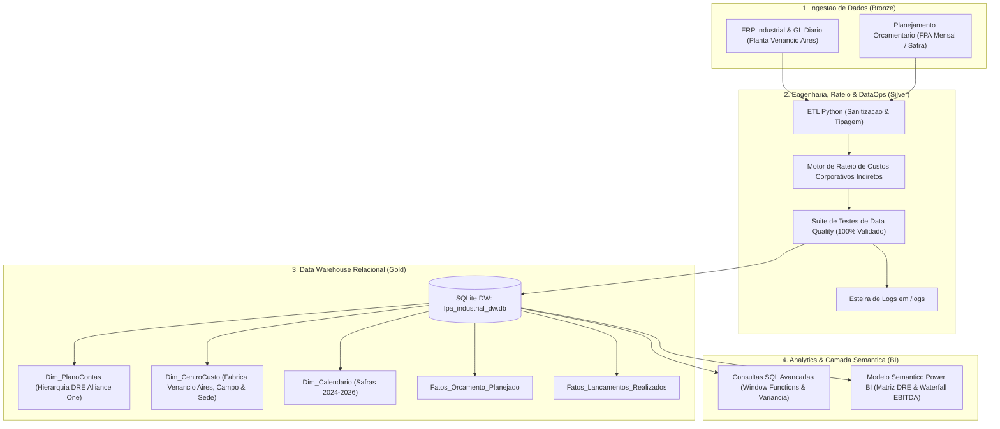
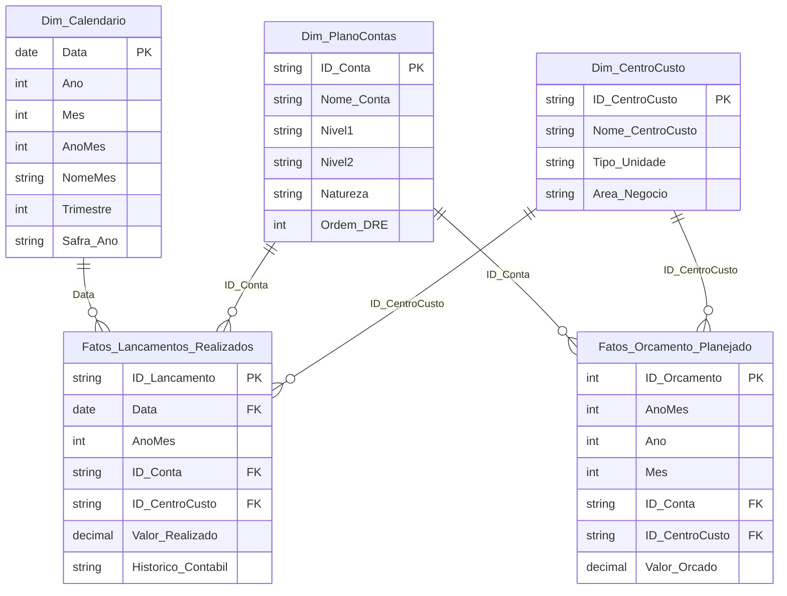

# Pipeline de FP&A & Controladoria Industrial (Alliance One - Polo Venâncio Aires)

Pipeline *End-to-End* de Engenharia de Dados, Data Warehousing e Planejamento e Controle Financeiro (FP&A - Orçado vs. Realizado) modelado sobre a realidade operacional e industrial da **Alliance One Brasil Exportadora de Tabacos Ltda.** (Sede e Polo Fabril em Venâncio Aires - RS).

A companhia atua no modelo *Leaf Merchant* (processamento, beneficiamento e exportação global de tabaco em folha crua e desengaçada, sem produção de cigarros acabados), destinando mais de **95% de sua produção ao mercado internacional** via embarques marítimos no Porto de Rio Grande (RS).

---

## Arquitetura da Solução



---

## Estrutura do Repositório

```text
pipeline-fpa-controladoria-industrial/
├── .env.example                     <- Variaveis de ambiente e configuracoes de execucao
├── README.md                        <- Visao executiva e arquitetura da solucao
├── DOCUMENTACAO.md                  <- Dicionario de dados, centros de custo e regras contabeis
├── logs/
│   └── pipeline_fpa.log             <- Logs estruturados de carga e auditoria
├── src/                             <- Engenharia de dados e esteira de transformacao
│   ├── config.py                    <- Parametros de ambiente e logger unificado
│   ├── generator.py                 <- Gerador de base sintetica com perfil Alliance One
│   ├── etl_pipeline.py              <- Pipeline ETL, rateio de custos corporativos e carga no DW
│   └── data_quality.py              <- Suite de testes automatizados de qualidade de dados
├── sql/                             <- Consultas e Scripts do Data Warehouse
│   ├── 01_ddl_star_schema.sql       <- DDL do modelo dimensional
│   ├── 02_analytical_queries.sql    <- Queries analiticas (YTD, YoY, Ranking de Ofensores)
│   └── 03_data_quality_audit.sql    <- Consultas de auditoria e conciliacao contabil
├── data/                            <- Banco de dados relacional e saidas em CSV
│   └── fpa_industrial_dw.db         <- Data Warehouse SQLite relacional
└── bi/                              <- Camada Semantica Power BI
    └── measures.dax                 <- Catalogo de medidas DAX em Display Folders
```

---

## Modelo Dimensional (Star Schema)



---

## Particularidades do Modelo de Negócio (Alliance One)

### 1. Dinâmica de Faturamento (Exportação > 95%)
O faturamento é composto por contratos internacionais de exportação de:
- **Strips Virgínia** (Lâminas desengaçadas de tabaco Virgínia)
- **Strips Burley** (Lâminas de tabaco Burley)
- **By-Products** (Talas / *Stems* e fumos picados)
- Imunidade tributária constitucional sobre receitas de exportação (ausência de incidência de ICMS/PIS/COFINS no faturamento externo).

### 2. Sazonalidade de Processamento & Fretes (Porto de Rio Grande)
- **Safra e Processamento Fabril (Março a Julho):** Pico de compra de tabaco cru dos produtores rurais integrados dos 3 estados do Sul (RS, SC, PR) e operação contínua das linhas de debulha mecânica (*Threshing*) e secadores contínuos (*Redryers*).
- **Embarques e Logística (Maio a Novembro):** Concentração do transporte rodoviário de caixas C-48 (200 kg) de Venâncio Aires até o Porto de Rio Grande (RS) e estufagem de contêineres marítimos.

### 3. Rateio Contábil de Despesas da Sede
Absorção contábil de 60% dos custos corporativos indiretos de TI e Gestão da Sede entre os quatro centros de custo fabris produtivos de Venâncio Aires (`CC1001` a `CC1004`).

---

## Como Executar o Projeto

```bash
# 1. Executar o pipeline ETL e carga no Data Warehouse
python src/etl_pipeline.py

# 2. Executar a suíte de auditoria e qualidade de dados
python src/data_quality.py
```

---

Desenvolvido por **Iago Walter**  
Engenheiro de Produção | Especialista em BI, Modelagem Dimensional e Analytics Engineering
