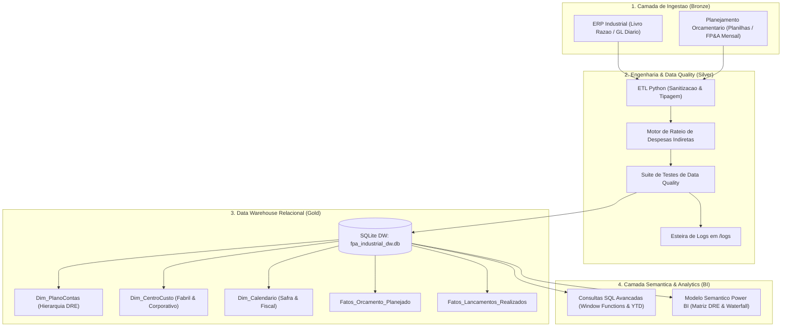
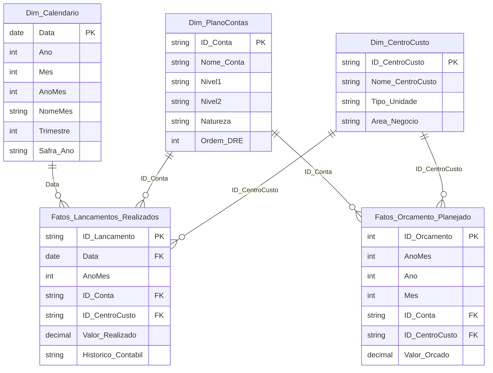

# Pipeline de FP&A & Controladoria Industrial (Beneficiamento de Tabaco)

Pipeline *End-to-End* de Engenharia de Dados, Data Warehousing e Planejamento e Controle Financeiro (FP&A - Orçado vs. Realizado) desenvolvido para uma indústria de médio porte do setor de processamento e beneficiamento de tabaco.

O projeto resolve o desafio de consolidação contábil gerencial entre fontes de dados com diferentes granularidades: o **Orçamento Anual/Mensal** (aprovado por centro de custo e conta) e os **Lançamentos Contábeis Reais** (granularidade diária de Livro Razão / *General Ledger*), aplicando regras de rateio de despesas indiretas corporativas e disponibilizando consultas analíticas de auditoria e DRE Gerencial.

---

## Arquitetura da Solução



---

## Estrutura do Repositório

```text
pipeline-fpa-controladoria-industrial/
├── .env.example                     <- Variaveis de ambiente e configuracao
├── README.md                        <- Visao executiva e arquitetura
├── DOCUMENTACAO.md                  <- Dicionario de dados, regras de rateio e linhagem
├── logs/
│   └── pipeline_fpa.log             <- Logs estruturados de auditoria e carga
├── src/                             <- Codigo-fonte do pipeline de dados
│   ├── config.py                    <- Parametros de ambiente e configurador de logs
│   ├── generator.py                 <- Gerador de base sintetica com sazonalidade de safra
│   ├── etl_pipeline.py              <- Extracao, transformacao, rateio e carga no DW
│   └── data_quality.py              <- Suite de testes automatizados de qualidade
├── sql/                             <- Scripts SQL do Data Warehouse
│   ├── 01_ddl_star_schema.sql       <- DDL do modelo dimensional
│   ├── 02_analytical_queries.sql    <- Queries analiticas (YTD, YoY, Variance Analysis)
│   └── 03_data_quality_audit.sql    <- Consultas de auditoria e conciliacao
├── data/                            <- Banco de dados e datasets exportados
│   └── fpa_industrial_dw.db         <- Data Warehouse SQLite relacional
└── bi/                              <- Camada Semantica e Relatorio
    └── measures.dax                 <- Catalogo de medidas DAX em Display Folders
```

---

## Modelo Dimensional (Star Schema)

O Data Warehouse adota a modelagem dimensional de Ralph Kimball para garantir integridade e velocidade analítica:



---

## Destaques de Engenharia e Regras de Negócio

### 1. Tratamento de Sazonalidade Industrial
A indústria de beneficiamento de tabaco possui forte concentração de safra entre os meses de **Março e Julho** (compra de matéria-prima, recepção, debulha e cura contínua) e concentração de faturamento e embarque portuário entre **Maio e Novembro**. O pipeline reflete essa curva operacional no orçamento e nas transações reais.

### 2. Rateio Contábil de Despesas Corporativas
O módulo `src/etl_pipeline.py` aplica a absorção de 60% das despesas corporativas indiretas de TI e Recursos Humanos sobre os quatro centros de custo produtivos fabris (`CC1001` a `CC1004`), gerando lançamentos contábeis rastreáveis de rateio gerencial.

### 3. DataOps & Qualidade de Dados
O pipeline executa testes automatizados com bloqueio de inconsistências:
- **Ausência de Chaves Nulas**: Validação de todas as PKs e FKs.
- **Integridade Referencial**: Detecção de lançamentos em centros de custo ou contas inexistentes.
- **Validação Temporal**: Bloqueio de datas fora da janela fiscal de análise.
- **Rastreabilidade**: Todas as etapas gravam status e volumetria em `logs/pipeline_fpa.log`.

---

## Como Executar o Projeto

### Pré-requisitos
- Python 3.9+ instalado
- Pacotes listados: `pandas`, `numpy`

### Passo a Passo

1. **Clonar o Repositório e Configurar o Ambiente:**
   ```bash
   cp .env.example .env
   ```

2. **Executar o Pipeline de Engenharia (ETL & Carga DW):**
   ```bash
   python src/etl_pipeline.py
   ```

3. **Executar a Suíte de Auditoria e Qualidade de Dados:**
   ```bash
   python src/data_quality.py
   ```

4. **Consultar as Análises em SQL:**
   - Execute os scripts contidos em `sql/02_analytical_queries.sql` conectando qualquer cliente SQL ao arquivo `data/fpa_industrial_dw.db`.

---

Desenvolvido por **Iago Walter**  
Engenheiro de Produção | Especialista em BI, Modelagem Dimensional e Analytics Engineering
